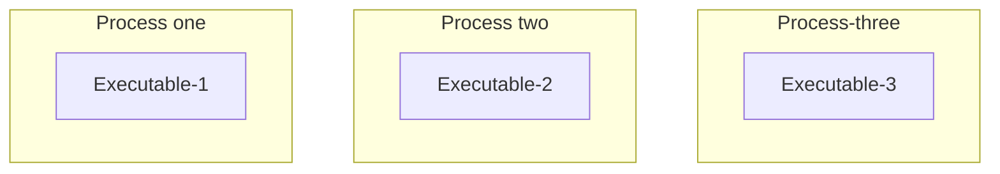

## MPR Multi process runner

MPR reads and execute js files in separate child processes.

```mermaid
graph TB
    subgraph Process-three
    Executable-3
    end
    subgraph Process two
    Executable-2
    end
    subgraph Process one
    Executable-1
    end
```